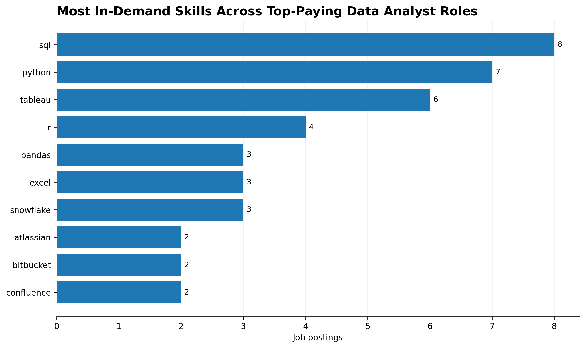
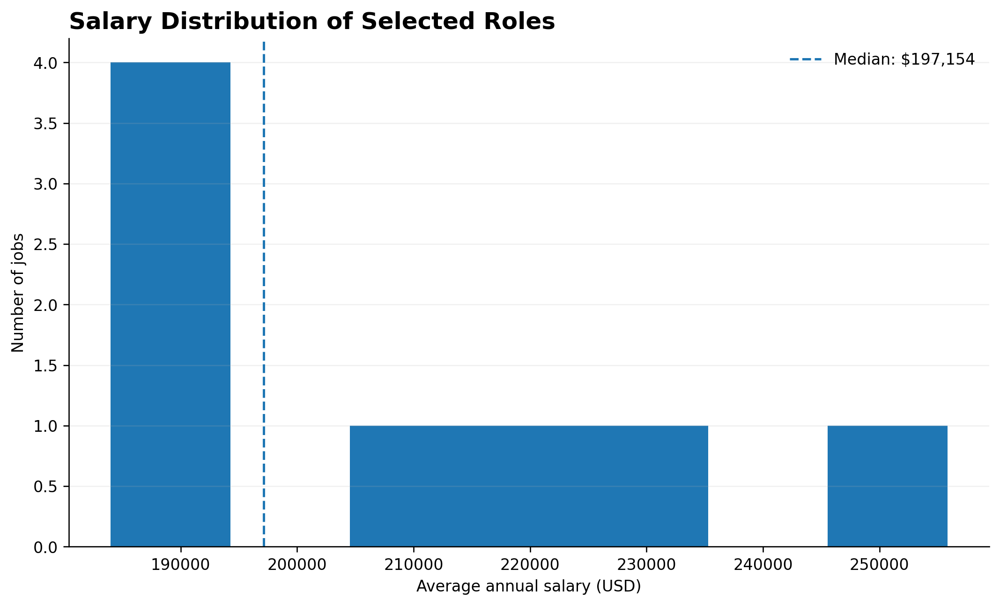
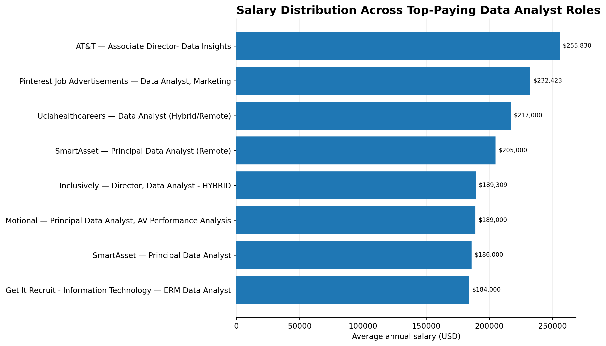
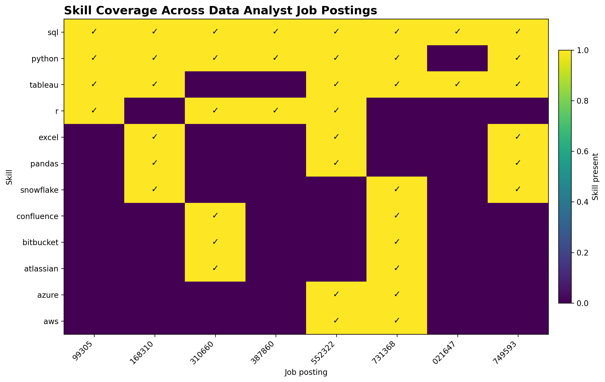
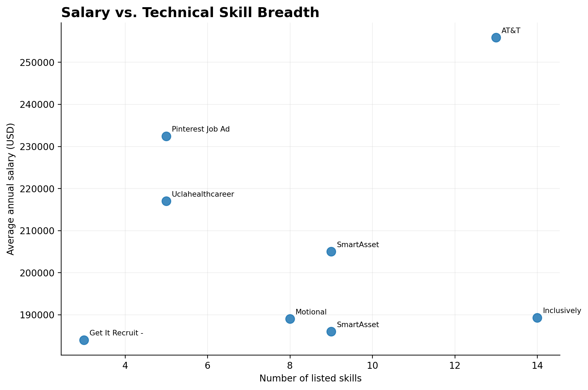

# 📊 Data Analyst Job Market Analysis

> A SQL and Python portfolio project analyzing Data Analyst job postings to identify salary trends, in-demand skills, high-paying skills, and the technical skill combinations employers are seeking.

---

## 🎯 Project Overview

The Data Analytics job market is constantly changing. For aspiring Data Analysts, it is important to understand not only **which tools are commonly requested**, but also how those skills relate to **salary and job opportunities**.

This project analyzes job-posting data to answer practical questions about the Data Analyst market:

- 💰 What are the highest-paying Data Analyst jobs?
- 🏢 Which companies offer high-paying opportunities?
- 🧠 Which technical skills are most frequently requested?
- 📈 Which skills are associated with higher salaries?
- ⚖️ Which skills provide a strong balance between demand and compensation?
- 🔍 Does having more listed technical skills necessarily correspond to higher salary?

The project combines **PostgreSQL SQL analysis** with **Python Exploratory Data Analysis (EDA)** and visualization.

---

# 🗂️ Dataset

The project uses four relational tables:

| Table               | Purpose                                                   |
| ------------------- | --------------------------------------------------------- |
| `job_postings_fact` | Job postings, titles, salaries, locations and company IDs |
| `company_dim`       | Company information                                       |
| `skills_dim`        | Skill names and categories                                |
| `skills_job_dim`    | Many-to-many relationship between jobs and skills         |

### Relationship between the tables

```text
                    ┌──────────────────┐
                    │  company_dim     │
                    │                  │
                    │ company_id       │
                    └────────┬─────────┘
                             │
                             │ company_id
                             ▼
┌──────────────────┐   ┌──────────────────┐
│  skills_job_dim  │◄──│ job_postings_fact│
│                  │   │                  │
│ job_id           │   │ job_id           │
│ skill_id         │   │ company_id       │
└────────┬─────────┘   └──────────────────┘
         │
         │ skill_id
         ▼
┌──────────────────┐
│   skills_dim     │
│                  │
│ skill_id         │
│ skills           │
└──────────────────┘
```

A single job can require multiple skills, and the same skill can appear across many jobs. This makes `skills_job_dim` a bridge table between jobs and skills.

---

# 🛠️ Tools & Technologies

### Database & SQL

- PostgreSQL
- SQL
- Common Table Expressions (CTEs)
- JOINs
- GROUP BY
- Aggregate Functions
- Subqueries
- CASE Statements
- UNION
- Filtering and Sorting

### Python & EDA

- Python
- Pandas
- NumPy
- Matplotlib
- Jupyter Notebook

### Development

- VS Code
- Git
- GitHub

---

# 🔎 SQL Analysis

The SQL portion of the project focuses on five main business questions.

### 1. Top-Paying Data Analyst Jobs

Identifies the highest-paying Data Analyst opportunities while considering job title, location and available salary information.

**SQL file:** `1_top_paying_jobs.sql`

### 2. Skills Required by Top-Paying Jobs

Connects high-paying jobs with their required skills using the relationship:

```text
job_postings_fact
        ↓
skills_job_dim
        ↓
skills_dim
```

**SQL file:** `2_top_paying_job_skills.sql`

### 3. Most In-Demand Skills

Ranks skills according to how frequently they appear across Data Analyst job postings.

**SQL file:** `3_top_demanded_skills.sql`

### 4. Highest-Paying Skills

Analyzes the average salary associated with individual skills.

**SQL file:** `4_top_paying_skills.sql`

### 5. Optimal Skills

Combines **skill demand and average salary** to identify skills that provide a strong balance between market demand and compensation.

**SQL file:** `5_optimal_skills.sql`

---

# 📈 Exploratory Data Analysis

After completing the SQL analysis, Python was used to perform a focused EDA and visualize the most important findings.

The EDA notebook is located at:

```text
sql_project/EDA/data_analyst_job_market_eda_project.ipynb
```

---

## 🔥 Most In-Demand Skills

One of the first questions was:

> **Which technical skills appear most frequently in Data Analyst job postings?**

The analysis shows strong demand for core analytical technologies, particularly **SQL and Python**, alongside business intelligence and visualization tools.



The demand distribution demonstrates that some technologies occur substantially more frequently than others. This makes skill frequency useful when deciding which technologies should form the foundation of a Data Analyst learning path.


---

## 💰 Salary Distribution

Understanding the distribution of salaries provides context for the compensation landscape rather than relying only on a single average.



The distribution shows that Data Analyst compensation varies considerably across job postings. Salary differences can reflect factors such as company, seniority, specialization, industry and responsibilities.


---

## 🏆 Salary Ranking

The project also examines the salary levels associated with the highest-paying opportunities.



The results demonstrate that Data Analyst positions can have substantial differences in compensation, highlighting the importance of looking beyond job title alone when evaluating opportunities.


---

## 🧠 Skill Coverage

Skill coverage was examined to understand how broadly individual technologies occur across the analyzed job postings.



This helps distinguish between skills that are repeatedly present across many jobs and skills that appear only in narrower combinations.


---

## 📊 Salary vs. Skill Breadth

A further question was:

> **Does a job requiring more technical skills necessarily offer a higher salary?**



The analysis does **not** support the idea that simply having a larger number of listed skills automatically results in higher compensation.

This is an important distinction: skill breadth alone is not a reliable proxy for salary.


---

# 💡 Key Insights

### 1. SQL Is a Core Data Analyst Skill

SQL appears consistently across the analyzed Data Analyst opportunities.

It is fundamental for:

- Extracting data
- Joining relational datasets
- Aggregating information
- Transforming data
- Answering business questions

### 2. Python Complements SQL

Python adds capabilities for:

- Data cleaning
- Data manipulation
- Exploratory analysis
- Automation
- Statistical analysis
- Visualization

SQL and Python therefore serve different but complementary roles in the analytical workflow.

### 3. BI & Visualization Skills Matter

Business intelligence and visualization technologies are important because analysts need to communicate findings to stakeholders, not simply retrieve data.

### 4. More Skills Do Not Automatically Mean Higher Salary

The analysis does not show that simply increasing the number of technologies listed in a job posting guarantees higher compensation.

Salary can also depend on:

- Experience
- Seniority
- Industry
- Company
- Specialization
- Job responsibilities

### 5. The Data Analyst Role Has a Broad Technical Ecosystem

The analyzed postings contain technologies spanning:

```text
SQL
Python
R
Excel
Tableau
Power BI
Pandas
NumPy
Cloud Platforms
Databases
Development Tools
```

This reflects the broad technical environment surrounding modern Data Analytics.

---

# 💼 Business Recommendation

The findings support a skill-development strategy based on **strong fundamentals followed by specialization**:

```text
SQL
  ↓
Data Analysis
  ↓
Python
  ↓
BI / Visualization
  ↓
Specialization
```

Rather than collecting technologies indiscriminately, candidates should build strong analytical fundamentals and then specialize according to their target role, industry and job market.

---

# 🖥️ Interactive Dashboard

The project also includes an interactive dashboard that allows the job market to be explored dynamically.

The dashboard contains **two filters**:

### Job Role

For example:

- Data Analyst
- Business Analyst
- Data Scientist
- Data Engineer
- Other roles available in the dataset

### Location / Work Arrangement

- All Locations
- Remote
- On-site

The two filters work together. For example:

```text
Data Analyst + Remote
```

shows the analysis specifically for remote Data Analyst opportunities.

The dashboard updates:

- Job postings
- Salary statistics
- Skill demand
- Average salary
- Highest-paying skills
- Top companies
- Salary distribution
- Highest-paying job postings

---

# ⚠️ Data Quality & Limitations

The dataset is stored at multiple relational grains.

A single job can have several skill records:

```text
Job 101 → SQL
Job 101 → Python
Job 101 → Tableau
```

Therefore, a job can appear multiple times after joining the job and skill tables.

Job-level calculations must account for this to avoid treating each job-skill row as an independent job.

### Sample Limitation

The exported skill-analysis dataset contains **8 unique job IDs**, although the analysis targeted the top 10 jobs.

Therefore, findings from that particular sample should be interpreted as **directional insights**, rather than statistically representative conclusions about the entire Data Analyst market.

### Interpretation Limitations

- Salary associations do not establish causation.
- Salary can vary because of experience, seniority, industry, company, specialization and responsibilities.
- The dataset does not represent every Data Analyst opportunity.
- Skill frequency does not prove that a skill causes higher compensation.

---

# 📁 Project Structure

```text
Data Analyst Job Market Analysis/
│
├── advanced_sql/
│   ├── 2_dates.sql
│   ├── 3_cases.sql
│   ├── subquries&CTE's.sql
│   └── unions.sql
│
├── csv_files/
│   ├── company_dim.csv
│   ├── job_postings_fact.csv
│   ├── skills_dim.csv
│   └── skills_job_dim.csv
│
├── sql_load/
│   ├── 1_create_database.sql
│   ├── 2_create_tables.sql
│   └── 3_modify_tables.sql
│
├── sql_project/
│   ├── EDA/
│   │   └── data_analyst_job_market_eda_project.ipynb
│   │
│   ├── Graphs/
│   │   ├── 01_skill_demand.png
│   │   ├── 02_salary_ranking.png
│   │   ├── 03_skill_coverage_heatmap.png
│   │   ├── 04_salary_vs_skill_breadth.png
│   │   └── 05_salary_distribution.png
│   │
│   └── Dashboard/
│       └── data_analyst_job_market_intelligence.html
│
├── 1_top_paying_jobs.sql
├── 2_top_paying_job_skills.sql
├── 3_top_demanded_skills.sql
├── 4_top_paying_skills.sql
├── 5_optimal_skills.sql
│
├── .gitignore
└── README.md
```

---

# 🧠 Skills Demonstrated

### Technical

- PostgreSQL
- SQL
- CTEs
- JOINs
- Aggregations
- Subqueries
- CASE Statements
- UNION
- Data Transformation
- Python
- Pandas
- NumPy
- Matplotlib
- Exploratory Data Analysis

### Analytical

- Business Question Formulation
- Data Validation
- Data-Grain Awareness
- Descriptive Analysis
- Comparative Analysis
- Salary Analysis
- Skill-Demand Analysis
- Data Visualization
- Insight Generation

### Business

- Job Market Analysis
- Skill Demand Analysis
- Compensation Analysis
- Evidence-Based Recommendations
- Communicating Analytical Findings

---

# 🚀 Conclusion

This project demonstrates an end-to-end analytical workflow:

```text
Raw Job Data
      ↓
PostgreSQL Database
      ↓
SQL Analysis
      ↓
Business Questions
      ↓
Python EDA
      ↓
Data Visualization
      ↓
Business Insights
```

The analysis indicates that **SQL remains a foundational requirement** across the selected Data Analyst opportunities, while Python and BI / visualization technologies provide complementary capabilities.

More importantly, the project demonstrates how job-market analysis can move beyond simply counting skills by combining:

**skill demand + compensation + job-level context**

to produce more meaningful career and business insights.

---

## ⭐ Project Focus

**PostgreSQL • SQL • Python • EDA • Data Visualization • Business Analysis • Job Market Intelligence**
